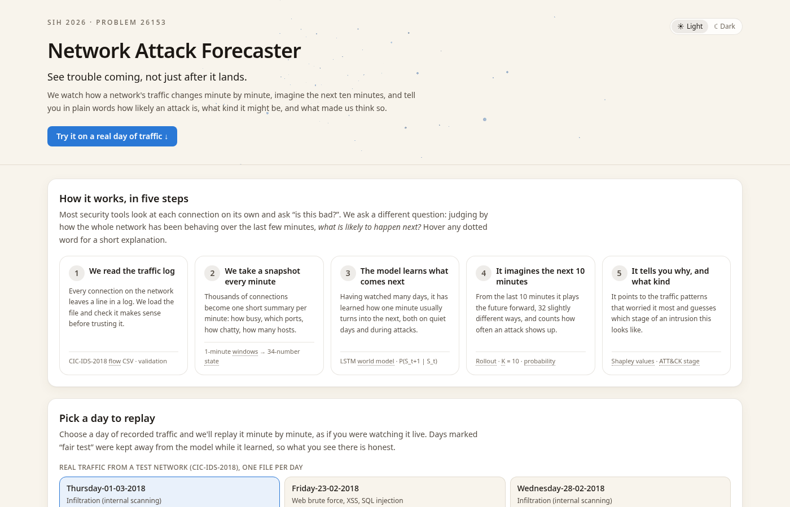
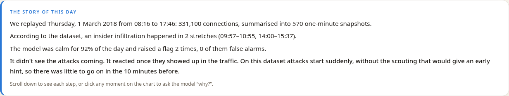
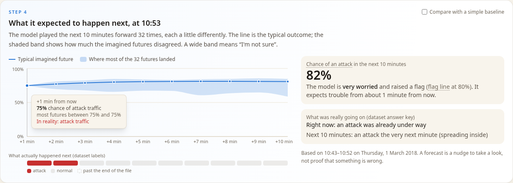
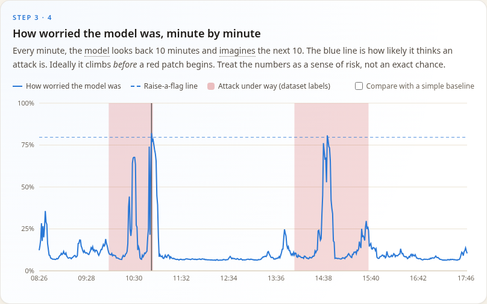
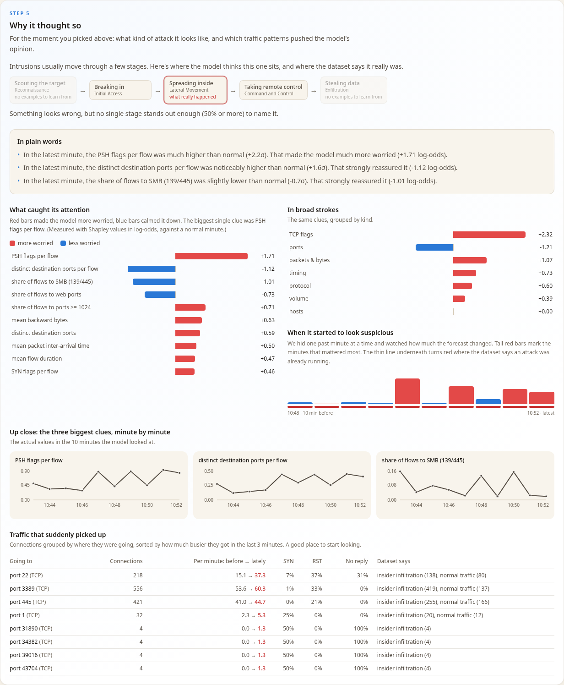
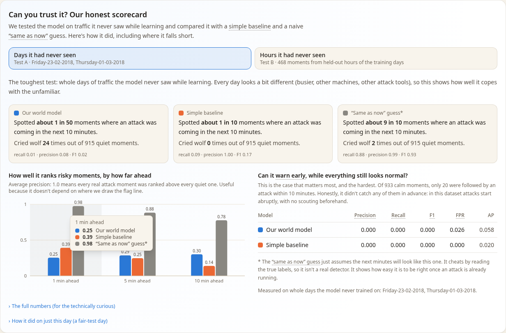
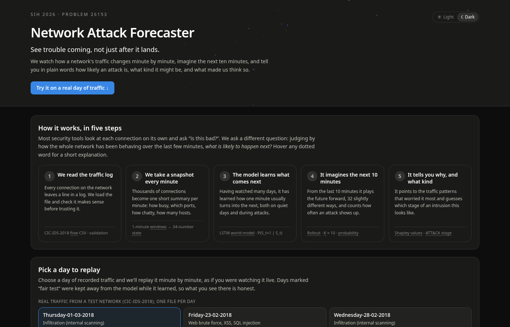

# Network Attack Forecaster

**See trouble coming, not just after it lands.** An AI system that learns how a computer network's traffic
behaves over time, imagines the next ten minutes, and warns defenders about likely attacks, with a plain-language
explanation for every forecast.

> Smart India Hackathon 2026 · Problem Statement **26153**: *AI based Network Attack Forecasting from Network Traffic Data*



---

## About the project

### The problem
Most intrusion-detection tools look at each network connection on its own and ask "is this one malicious?".
Real intrusions don't work like that. They unfold over minutes or hours: someone scouts the network, breaks in,
spreads inside and takes control. By the time a single connection looks clearly malicious, much of the damage is
done. Defenders need a system that watches how the *whole* network is behaving, notices when things are drifting
towards an attack, and says *why*.

### Our approach: a world model of the network
Instead of labelling connections, we teach a model how the network **changes from one minute to the next**.

1. **Every minute becomes a snapshot.** Thousands of flow records are summarised into a 34-number *network state*:
   traffic volume, protocol mix, timing, packet and byte sizes, TCP flag rates, port usage and how many hosts are talking.
2. **A world model learns the dynamics.** An LSTM reads the last 10 snapshots and learns P(S<sub>t+1</sub> | S<sub>≤t</sub>),
   a probability distribution over what the *next* minute will look like. Alongside it, the model learns whether that
   minute will contain attack traffic and which intrusion stage it resembles.
3. **It imagines the future.** From the current situation the model plays the next 10 minutes forward, feeding its own
   predictions back in, 32 times with small random variations. The result is an infiltration probability for each
   future minute, with an uncertainty band.
4. **It explains itself.** Shapley values (the method behind SHAP) show which traffic features pushed the forecast up
   or down. A second view shows which past minutes mattered, and a table lists the destinations whose traffic suddenly
   grew. The forecast is mapped to an ATT&CK-style stage: reconnaissance, initial access, lateral movement, command
   and control, or exfiltration.
5. **It is honest about how good it is.** The model is benchmarked on days of real traffic it never saw during training.
   It is compared with a logistic-regression baseline on the same inputs and with a naive "same as now" reference, and
   the dashboard shows where it falls short as clearly as where it works.

### What you can do with it
- **Replay a real day of traffic** (CIC-IDS-2018) minute by minute and watch how worried the model gets, and when.
- **Click any moment** to see the 10 minutes the model imagined, what really happened next, and why it thought so.
- **Upload your own** CICFlowMeter CSV. It is validated first, and problems are explained in plain words.
- **Train and evaluate** from the command line, with saved weights, configuration and metrics for every model.
- **Run it anywhere, fully offline**: on a laptop or as a single Docker/Podman container.

| The story of a day | What the model imagined next |
|---|---|
|  |  |

| Minute-by-minute forecast | Why it thought so |
|---|---|
|  |  |

### Problem-statement coverage

| Asked for in PS 26153 | Status |
|---|---|
| Represent network state as feature vectors or graphs | ✅ 34-feature state per minute |
| Learn state-transition dynamics P(S<sub>t+1</sub> \| S<sub>t</sub>) with a sequence model | ✅ LSTM world model with a Gaussian next-state head |
| Forward simulation: K-step rollout with an infiltration probability over time | ✅ 10-step rollouts, 32 samples, per-minute probability and uncertainty band |
| Map predictions to attack stages (MITRE ATT&CK phases) | ✅ stage head plus a documented, conservative label mapping |
| Explainability: SHAP values or attention | ✅ Shapley values (permutation sampling), per-minute occlusion, flagged flows |
| Ingest CIC-IDS-2018 or CTU-13 CSV flow records | ✅ CIC-IDS-2018 (tested on 9 real days) · ⏳ CTU-13 recognised, not yet supported |
| Flow-level **and** packet-level (PCAP) features | 🟡 flow-level done · ⏳ PCAP / packet-level features are future work |
| Offline demo interface (Streamlit, Flask web app or CLI) accepting CSV/PCAP | ✅ web app (FastAPI + React) **and** CLI, fully offline · CSV only |
| Training scripts, model weights and reproducible configuration | ✅ `netforecast.cli train`, weights in `artifacts/`, `config.json` per model |
| Benchmark against logistic regression (F1, precision, recall, FPR) | ✅ done on real held-out days; the world model does **not** yet beat it (see [Results](#results-on-real-data-cic-ids-2018)) |
| Generalise to unseen attack patterns | 🟡 evaluated on unseen days; generalisation is the main open problem |

---

## Quick start

**With a container** (the fastest way, everything included):

```bash
podman build --format docker -t netforecast .        # or: docker build -t netforecast .
podman run --rm -p 8000:7860 netforecast             # then open http://localhost:8000
```

**On your machine:**

```bash
python3 -m venv .venv
.venv/bin/pip install torch --index-url https://download.pytorch.org/whl/cpu
.venv/bin/pip install -r requirements.txt
cd frontend && npm install && npm run build && cd ..
.venv/bin/uvicorn netforecast.api:app --port 8000    # open http://localhost:8000
```

The trained models are already in `artifacts/`. To replay real traffic, download at least one CIC-IDS-2018 day
(see [Commands](#commands)) into `data/cic2018/`, or run `python -m netforecast.cli make-synthetic` for practice data.

Tested with Python 3.14, torch 2.14 (CPU), pandas 3.0, scikit-learn 1.9, FastAPI 0.141; Node 22, React 19, Vite 8.

## Tech stack

| Layer | Technology |
|---|---|
| Model | PyTorch (CPU) LSTM world model · scikit-learn logistic-regression baseline |
| Data | pandas feature pipeline over CICFlowMeter flow CSVs |
| Explainability | Shapley values by permutation sampling (SHAP-style), occlusion |
| Backend | FastAPI (Python web framework, the same family as Flask) · command-line tool |
| Frontend | React 19, Vite, Tailwind CSS, Recharts, [React Bits](https://reactbits.dev) components |
| Packaging | Docker/Podman image, runs fully offline |

## How it works

```
flow CSV ─► schema.py    validate columns; parse day-first timestamps; fix CIC-IDS-2018 clock quirks
         ─► windows.py   flows → 1-minute windows → 34-feature state S_t (+ window labels / stages)
         ─► split BEFORE sequences: whole unseen days = test A; stratified held-out time blocks of
            the training days = validation + test B; scaler fitted on training windows only
         ─► sequences: context S_t-9..S_t  →  future S_t+1..S_t+10 and their labels
         ─► models.py    world model (LSTM): Gaussian next-state head + attack head + stage head,
                         trained with teacher forcing + open-loop 10-step rollout loss
                         baseline: logistic regression per future step (same inputs, flattened)
         ─► simulate():  32 sampled rollouts → per-minute probability band + P(attack within K)
         ─► explain.py   permutation Shapley values (SHAP-style) + per-minute occlusion
api.py   ─► local FastAPI server (/api/*) that also serves the built React dashboard
frontend ─► guided flow: how it works → pick data → read → state → forecast → simulation → why/stage → scores
```

### Project structure

| Path | Responsibility |
|---|---|
| [netforecast/schema.py](netforecast/schema.py) | Input columns, aliases, validation, CIC-IDS-2018 timestamp repair |
| [netforecast/windows.py](netforecast/windows.py) | Window state features, splits (incl. blocked validation), K-step sequences |
| [netforecast/models.py](netforecast/models.py) | World model, training loss, forward simulation, baseline, metrics |
| [netforecast/explain.py](netforecast/explain.py) | Shapley feature attribution, temporal importance, plain-language summaries |
| [netforecast/stages.py](netforecast/stages.py) | Label → attack-stage mapping (documented rules) |
| [netforecast/pipeline.py](netforecast/pipeline.py) | Train / evaluate / analyze, model bundle I/O, flagged flows |
| [netforecast/api.py](netforecast/api.py) | HTTP API used by the dashboard (public mode, upload limit, health check) |
| [netforecast/cli.py](netforecast/cli.py) | Command-line tool |
| [netforecast/synthetic.py](netforecast/synthetic.py) | Synthetic CIC-format practice data (smoke tests and demo only) |
| [frontend/](frontend/) | React dashboard |
| [artifacts/](artifacts/) | Trained models: weights, configuration, training history, metrics |
| [tests/](tests/) | 60 tests: validation, windows and splits, sequences, models, explanations, API |
| [Dockerfile](Dockerfile), [DEPLOY.md](DEPLOY.md) | Container image and deployment guide |

## Commands

```bash
# tests (60 tests, ~15 s)
.venv/bin/python -m pytest -q

# real data: CIC-IDS-2018 processed CSVs (public S3, ~2.8 GB for the 9 files used here)
mkdir -p data/cic2018 && cd data/cic2018
for f in Wednesday-14-02-2018 Thursday-15-02-2018 Friday-16-02-2018 Wednesday-21-02-2018 Thursday-22-02-2018 \
         Friday-23-02-2018 Wednesday-28-02-2018 Thursday-01-03-2018 Friday-02-03-2018; do
  curl -O "https://cse-cic-ids2018.s3.ca-central-1.amazonaws.com/Processed%20Traffic%20Data%20for%20ML%20Algorithms/${f}_TrafficForML_CICFlowMeter.csv"
done; cd ../..

# train + evaluate the world model (≈5 min on a laptop CPU)
.venv/bin/python -m netforecast.cli train --data data/cic2018 --out artifacts/cic2018 \
    --test-captures Friday-23-02-2018_TrafficForML_CICFlowMeter Thursday-01-03-2018_TrafficForML_CICFlowMeter \
    --val-blocks 120

# synthetic practice data + model (smoke test only; not a benchmark)
.venv/bin/python -m netforecast.cli make-synthetic --out data/synthetic
.venv/bin/python -m netforecast.cli train --data data/synthetic --out artifacts/synthetic-demo

# re-evaluate a saved model on other labeled files / write per-minute forecasts for one file
.venv/bin/python -m netforecast.cli evaluate --model artifacts/cic2018 --data path/to/labeled.csv
.venv/bin/python -m netforecast.cli analyze --model artifacts/cic2018 --data path/to/file.csv --out forecasts.csv

# dashboard: API + built frontend at http://localhost:8000
.venv/bin/uvicorn netforecast.api:app --port 8000
# frontend development with hot reload (http://localhost:5173, proxies /api to :8000)
cd frontend && npm run dev
```

Train options: `--window` (seconds, default 60), `--seq-len` (context windows, default 10), `--k` (windows
to simulate, default 10), `--attack-threshold` (default 0.05), `--val-blocks` (validation/test-B block size
in windows), `--epochs`, `--hidden`, `--seed`. Each trained model directory holds the weights
(`world_model.pt`, `baseline.joblib`, `scaler.joblib`), the full configuration and training history
(`config.json`), and results (`metrics.json`, `metrics.md`).

## Deployment

One container serves the API and the dashboard. It runs in public mode, which blocks retraining from the web and
limits uploads to 200 MB. [DEPLOY.md](DEPLOY.md) covers three routes: a free public link on Hugging Face Spaces, a
temporary tunnel from your laptop, and saving the image to a file.

## Supported input: CIC-IDS-2018 flow CSV

| Column | Required | Used for |
|---|---|---|
| `Timestamp` (`dd/mm/YYYY HH:MM:SS`) | yes | window assignment |
| `Dst Port`, `Protocol` | yes | port-group shares, distinct ports, protocol mix |
| `Flow Duration`, `Tot Fwd Pkts`, `Tot Bwd Pkts` | yes | duration / packet statistics |
| `TotLen Fwd Pkts`, `TotLen Bwd Pkts`, `Flow IAT Mean` | no | byte and timing statistics |
| `FIN/SYN/RST/PSH/ACK/URG Flag Cnt` | no | TCP flag rates |
| `Src IP`, `Dst IP` | no | *counts* of distinct addresses/pairs per window (never identities) |
| `Label` | for training/evaluation | window targets and stages |

- Header matching ignores case and surrounding spaces. CIC-IDS-2017 spellings are accepted as aliases.
- Repeated header rows, unparseable timestamps and non-numeric required values are dropped with a warning. If more than 50 % of rows are malformed, the file is rejected.
- **CIC-IDS-2018 clock repair.** The public CSVs use a 12-hour clock without AM/PM, so afternoon flows (13:00–19:59) appear as 01:00–07:59. This scrambles time order: for example, SSH brute force on 14-02 is documented at 14:01–15:31 but written as 02:01–03:31. The loader detects the pattern and shifts those hours by +12 h, and drops a few rows dated 1970. Both fixes are reported as warnings.
- The processed CSVs are capped at 1,048,575 rows (Excel's limit), so most days are incomplete. The public 2018 CSVs have no IP columns, so the three host-count features are zero there.
- CTU-13 `.binetflow` files are recognised and rejected with an explanation. PCAP input is future work.

## Method

- **State S<sub>t</sub>** (34 numbers per minute): log flow count; TCP/UDP/other shares; duration mean/std/max; forward/backward packets and bytes; share of flows with no reply; mean inter-arrival time; SYN/RST/FIN/PSH/ACK/URG rates; distinct destination ports; shares of flows to FTP/SSH/web/RDP/SMB/DNS/high ports; distinct source/destination hosts and pairs.
- **Attack window**: at least 5 % of the window's flows are labeled malicious.
- **World model** (LSTM, 64 units) with four heads read from the hidden state h<sub>t</sub>:
  - μ(h<sub>t</sub>), σ²(h<sub>t</sub>): a Gaussian over the next state, P(S<sub>t+1</sub> | S<sub>≤t</sub>)
  - the probability that window t+1 is an attack window
  - the ATT&CK-style stage of window t+1

  Loss: teacher-forced Gaussian NLL + BCE + stage cross-entropy over every position of context+future, plus an **open-loop 10-step rollout loss**. The open-loop term trains the model to forecast from its own predictions, the way it is used.
- **Forecast = forward simulation**: from the observed context, sample S<sub>t+1</sub>, feed it back, repeat K = 10 times, and do this 32 times. Outputs:
  - a per-minute attack probability with a 10–90 % band
  - P(attack within K), taken as the peak per-step probability on each trajectory averaged over trajectories. Consecutive minutes are strongly correlated, so an independence product would overstate it.
- **Baseline**: logistic regression (`class_weight="balanced"`), one per future step plus one for "attack within K", on the same flattened context.
- **Persistence reference**: "the future looks like the current minute". It uses true labels, so it is not a detector. It shows how much of any score comes from attacks that are already running.
- **Splits**:
  - **Test A**: entire capture days never seen in training (23-02 web attacks, 01-03 infiltration).
  - **Validation** and **test B**: stratified random 2-hour blocks of the training days (20 % and 15 % of the blocks, split by attack presence, seed 42). Each block is its own capture, so no sequence crosses a boundary.
  - Thresholds (max-F1) and early stopping use validation only.
- **Explanation**:
  - Shapley values estimated by permutation sampling (as in SHAP's PermutationExplainer) on the rollout's mean attack log-odds. They sum exactly to prediction − baseline, where the baseline is all-average traffic.
  - Per-minute occlusion shows *when* the evidence appeared.
  - "Flagged flows" lists the destination-port groups whose rate grew most in the last three minutes of the context.

## Attack-stage mapping

| Dataset label contains | Stage | Confidence | Why |
|---|---|---|---|
| `portscan`, `scan` | Reconnaissance | medium | external port scanning (CIC-IDS-2017 PortScan; none in 2018) |
| `brute`, `ftp-`, `ssh-`, `patator` | Initial Access | medium | password guessing against exposed services |
| `sql injection`, `xss`, `web attack` | Initial Access | medium | exploitation attempts on a public web app |
| `infilt` | Lateral Movement | **low** | 2018 infiltration traffic is mostly internal sweeps from a compromised host |
| `bot` | Command and Control | medium | botnet controller traffic |
| DoS / DDoS labels | *(unmapped)* | – | Impact, outside the five stages |
| – | Exfiltration | – | **never assigned**: no CIC-IDS-2018 label supports it |

The dashboard shows a stage only for alerts, and only when the stage head gives it at least 50 %; stages never seen in training are greyed out. No ATT&CK technique IDs are claimed.

## Results on real data (CIC-IDS-2018)

Nine processed day files: 14-02, 15-02, 16-02, 21-02, 22-02, 28-02, 02-03 for training; 23-02 and 01-03 held out.
Context of 10 minutes, forecast of the next 10. Full tables are in [artifacts/cic2018/metrics.md](artifacts/cic2018/metrics.md).

**Test A: entirely unseen days** (1,088 forecasts, 173 followed by an attack within 10 min)

| Model | Precision | Recall | F1 | FPR | AP |
|---|---|---|---|---|---|
| World model | 0.077 | 0.012 | 0.020 | 0.026 | 0.287 |
| Logistic regression | 1.000 | 0.092 | 0.169 | 0.000 | 0.361 |
| Persistence reference (uses labels) | 0.987 | 0.884 | 0.933 | 0.002 | 0.891 |

By horizon, the world model's ranking holds up better further ahead: its AP at t+10 is 0.30 against 0.14 for logistic regression. At t+1 it is lower, 0.25 against 0.39.

**Test B: unseen hours of the training days** (468 forecasts, 55 positive)

| Model | Precision | Recall | F1 | FPR | AP |
|---|---|---|---|---|---|
| World model | 0.462 | 0.218 | 0.296 | 0.034 | 0.301 |
| Logistic regression | 0.933 | 0.255 | 0.400 | 0.002 | 0.472 |
| Persistence reference (uses labels) | 1.000 | 0.564 | 0.721 | 0.000 | 0.615 |

**Validation** (used for model selection, so optimistic): the world model ranks next-minute attacks better than the baseline, with AP 0.80–0.85 against 0.71. On "attack within 10 minutes" the two are level, 0.75 against 0.77.



**Reading these numbers honestly**
- On real held-out data the world model does **not** yet beat the logistic-regression baseline overall. The problem statement asks for "measurable improvement", and on this data that has not been shown.
- **Neither model gives early warning:** 0 of 20 attack onsets were caught while the current minute was still benign. CIC-IDS-2018 attacks are scripted and start abruptly, with no reconnaissance lead-in in the labels. This is a limit of the dataset as much as of the models.
- Results swing noticeably with which days and hours fall into each split. The training set is small (about 1,700 overlapping 20-minute sequences from 7 days) and the model overfits after a few epochs. More days (the 4 GB 20-02 file, the complete PCAP-derived flows, CTU-13) are the most direct fix.
- On synthetic data, where attacks have a scripted reconnaissance lead-in, the world model does give early warning. There it catches 23 % of onsets at 67 % precision, while logistic regression catches none. That shows the mechanism can work when precursors exist, but synthetic numbers are **not** a benchmark.

## Limitations and roadmap

**Current limitations**
- The real-data benchmark is weak (see above), and scores are uncalibrated.
- Packet-level (PCAP) features are not implemented yet, although the problem statement asks for both levels.
- Stage predictions are only as good as the label mapping, and the 2018 labels contain no reconnaissance or exfiltration.
- A trained model reflects the network, tools and attack families in its training days.

**Next steps**
1. **More and richer data:** the remaining CIC-IDS-2018 day (4 GB), CTU-13 botnet captures, and full PCAP-derived flows.
2. **Packet-level features:** TTL variance, TCP window sizes, retransmissions and scan signatures extracted with Scapy/PyShark.
3. **Stronger generalisation:** model ensembles, stronger regularisation and domain adaptation across days and networks.
4. **Live deployment:** ingest NetFlow/IPFIX from routers or a network tap, forecast every minute, and push alerts to a SIEM (Splunk, ELK).

```
Routers / switches ──NetFlow/IPFIX──┐
Network tap (PCAP) ──CICFlowMeter───┼──► Forecaster service (world model) ──► Web dashboard (analysts)
                                    │                                     └──► Alerts to SIEM
```

## Dashboard

A single-page guided flow written in plain language:
- Headings are questions a visitor would ask.
- A "story of this day" card sums up each run in a few sentences.
- Attack stages have everyday names ("breaking in", "spreading inside").
- Every technical term keeps a hover definition.
- **Light or dark theme:** the page starts in the computer's own setting, and the switch at the top right flips it and remembers the choice. Chart colours are validated separately for each theme.

The sections, top to bottom:

1. **How it works**: a 5-step pipeline strip that animates while an analysis runs.
2. **Pick a day to replay**: a real CIC-IDS-2018 day (held-out days are marked "fair test"), practice data, or your own CSV. The model is matched to the data automatically.
3. **Step 1 · First, we checked the file**: the validation report, including the clock-repair warnings.
4. **The story of this day** and headline numbers.
5. **Step 2 · How busy the network was**: connections per minute, with labeled attack periods shaded.
6. **Steps 3–4 · How worried the model was**: attack probability at every minute, the flag line, attack bands, early-warning markers and an optional baseline, plus the list of moments it raised a flag.
7. **Step 4 · What it expected to happen next**: the 10-minute simulation for the selected moment, with its uncertainty band, the baseline, and what actually happened.
8. **Step 5 · Why it thought so**:
   - a kill-chain view and plain-language reasons
   - Shapley bars for individual features and for feature families
   - when the evidence appeared
   - the top clues minute by minute
   - traffic that suddenly picked up
9. **Can you trust it?**: a scorecard for unseen days and unseen hours, in plain words and full numbers.



---

## Team

| Name | Role |
|---|---|
| _add name_ | _add role_ |

## Acknowledgements

- **Dataset:** CSE-CIC-IDS2018 by the Communications Security Establishment and the Canadian Institute for Cybersecurity. I. Sharafaldin, A. H. Lashkari, A. A. Ghorbani, *Toward Generating a New Intrusion Detection Dataset and Intrusion Traffic Characterization*, ICISSP 2018.
- **UI components:** [React Bits](https://reactbits.dev) (MIT + Commons Clause), vendored in [frontend/src/components/reactbits/](frontend/src/components/reactbits/). Local changes:

  | Component | Use | Local changes |
  |---|---|---|
  | DecryptedText | title reveal | none |
  | Particles | header background (skipped when the OS asks for reduced motion) | none |
  | SpotlightCard | panels and KPI tiles | padding, radius and background set by the caller |
  | CountUp | KPI numbers | critically damped spring, so values settle exactly |
  | AnimatedList | alert list | generic items; keys scoped to the list instead of capturing Tab page-wide |
